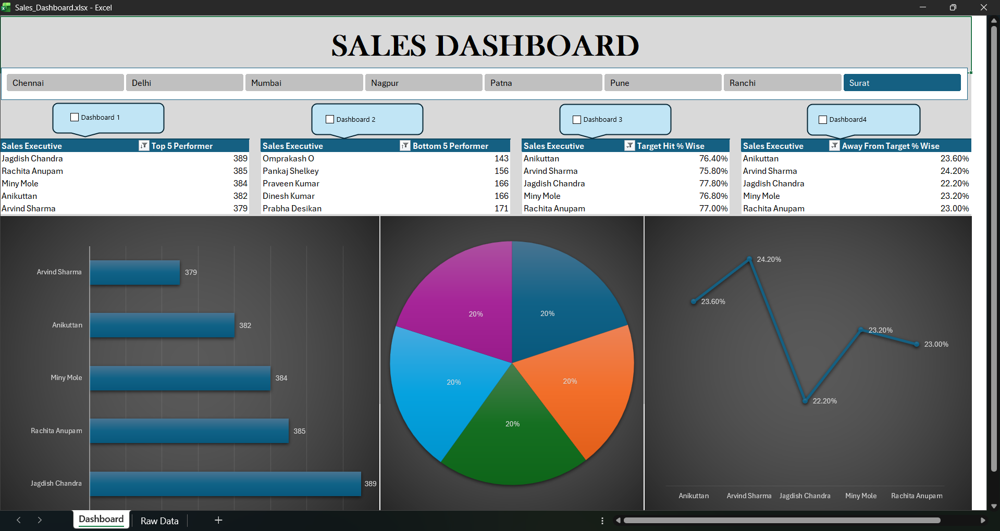

# 📊 Sales Dashboard - Excel Project

## 📌 Project Overview

This project presents an **interactive Sales Dashboard built using Microsoft Excel** to analyze and visualize sales performance across multiple cities and sales executives.

The dashboard helps in identifying **top performers, underperformers, and target achievement percentages**, enabling better business decision-making.

---

## 📈 Key Insights Displayed

* Top 5 Sales Executives
* Bottom 5 Sales Executives
* Target Hit Percentage
* Away From Target Percentage
* City-wise sales filtering

---

## 🛠 Tools & Skills Used

* Microsoft Excel
* Pivot Tables
* Pivot Charts
* Slicers for filtering
* Data Visualization
* Dashboard Design

---

## 📷 Dashboard Preview

dashboard.png.png

---

## 📊 Dashboard Features

* Interactive **City Filter Buttons**
* Dynamic **Bar Chart for Top Performers**
* **Pie Chart Visualization**
* **Performance Comparison Line Chart**
* Clean and structured **dashboard layout**

---

## 📂 Files Included

* `Sales_Dashboard.xlsx` → Excel dashboard file
* `dashboard.png` → Screenshot preview of the dashboard
* `README.md` → Project documentation

---

## 🚀 How to Use

1. Download the repository
2. Open **Sales_Dashboard.xlsx**
3. Use the **city filter buttons** to explore the dashboard
4. Analyze performance metrics and visual charts

---

## 👨‍💻 Author

**Naveen Babu Kommu**

📧 Email: [naveenbabukommu543@gmail.com](mailto:naveenbabukommu543@gmail.com)
📍 Hyderabad, India

---

⭐ If you found this project useful, feel free to star the repository!
